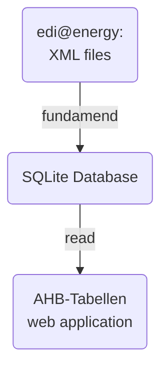

# AHB-Tabellen Web Application

## ℹ️ Overview

### Production

You can access the **prod** version of the application on [ahb-tabellen.hochfrequenz.de](https://ahb-tabellen.hochfrequenz.de).

### Stage

You can access the **stage** version of the application on [ahb-tabellen.stage.hochfrequenz.de](https://ahb-tabellen.stage.hochfrequenz.de).

This is our test environment where we deploy the latest changes to test them before deploying them to production.

### 🏛 Architecture

The AHB tables application follows a simple but effective architecture for processing and displaying Anwendungshandbücher (AHB) data:

1. **Data Source**: The process begins with XML files from edi@energy, which contain the official AHB specifications.
2. **Data Processing**: Our Python package `fundamend` processes these XML files, extracting and structuring the data into a SQLite database format.
3. **Web Application**: The AHB tables web application reads directly from the SQLite database to display the structured AHB information to users.

This architecture ensures data consistency and provides a reliable way to access and display AHB information.



### 📂 Project Structure

This is an API first application.
Whenever you want to change something in between frontend and backend, start by changing the [OpenAPI spec](openapi.yml) first and continue from there (`npm run ng-openapi-gen`).

```plaintext
.
├── src/
    ├── app/
        ├── core/
            └── api/              # API config files
        ├── environments/         # config files for dev/stage/prod
        ├── features/             # AHB and landingpage related views and components
        └── shared/               # global components (header, footer, logo, etc.)
    ├── assets/                   # logo, favicon, etc.
    ├── server/
        ├── controller/           # thin HTTP adapters: parse request → call service → serialize response
        ├── service/              # transport-agnostic business logic (shared by the REST API and the MCP server)
        ├── mcp/                  # Model Context Protocol server (Streamable HTTP) exposing the services as tools
        ├── infrastructure/       # API routing, database access, error handling
        └── repository/           # CRUD / query operations against the SQLite database
    ├── index.html                # entry point for the angular web application
    ├── main.ts                   # bootstraps the angular web application
    ├── server.ts                 # sets up backend server
    └── styles.scss               # imports Tailwind base styles, component styles and utility classes
└── ⚙️ <several config files>
```

## ⚙️ Setup

Make sure you have the latest version of [node.js](https://nodejs.org/en) installed (for instance via the [node version manager](https://github.com/nvm-sh/nvm) `nvm`).

Download and install [Angular CLI](https://v17.angular.io/cli) using the `npm` package manager (comes with node.js):

```bash
$ npm install -g @angular/cli
```

[**Windows**] Add node.js to your PATH environment variable:

- run `$ npm config get prefix` to retrieve the directory where npm will install global packages (e.g. `C:\Program Files\nodejs`)
- open "Edit the system environment variables" and navigate to "Environment Variables" -> "System Variables" -> "Path"
- edit "Path" and add the node.js directory path
- restart your PC and check if Angular CLI has been installed successfully by running `$ ng --version`

> [!NOTE]
> Be sure to run `$ npm ci` during the initial setup to install all required dependencies.

### Starting the app via Docker 🐋

Create an `.env` file in the root directory and paste the contents of the `.example.env` file.

> [!IMPORTANT]
> The application requires a SQLite database to function.
> This database is stored in an encrypted 7z archive at `src/server/data/ahb.db.encrypted.7z`.
> You will need the password to decrypt this archive, which can be found in the Hochfrequenz 1Password vault at [this link](https://start.1password.com/open/i?a=F35NURJ4PFGOPBA77PR66C5P4I&v=vjgfwz7dg5wg656rfpvadetrqy&i=grnjb4hn6ipcau4bqe43rkuwnq&h=hochfrequenz.1password.com).
>
> If you don't have access to the 1Password vault, please ask your teammates how to get the password.
>
> To work locally, you need to decrypt the archive and store the decrypted file in at `src/server/data/ahb.db`.
>
> If you want to start the application with Docker, you need to set the `DB_7Z_ARCHIVE_PASSWORD` environment variable in the `docker-compose.yaml` file either by setting it directly or by using the `.env` file.
> We recommend the latter to keep the `docker-compose.yaml` file clean and readable.

While having [Docker Desktop](https://www.docker.com/products/docker-desktop/) up and running, start the docker container using

```bash
$ docker compose up -d --build
```

and navigate to `http://localhost:4000/`.

If this fails to start because of azure-mock problems, just copy the _unencrypted_ database to `src/server/data/ahb.db` and start the Angular CLI server.

### Starting the app using Angular CLI

To start a dev server, run

```bash
$ ng serve
```

and navigate to `http://localhost:4200/`.
The application will automatically reload if you change any of the source files.

In order to start both the dev server as well as the server-side watch process to access the blob storage, run

```shell
$ npm run start
```

For further commands, refer to the scripts located in `package.json`.

## 🛠️ Build & Development

### Code scaffolding

Run `ng generate component component-name` to generate a new component. You can also use `ng generate directive|pipe|service|class|guard|interface|enum|module`.

### Build

Run `ng build` to build the project. The build artifacts will be stored in the `dist/` directory.

### Running unit tests

Run `ng test` to execute the unit tests via [Karma](https://karma-runner.github.io).

### Running end-to-end tests

Run `ng e2e` to execute the end-to-end tests via a platform of your choice. To use this command, you need to first add a package that implements end-to-end testing capabilities.

### OpenAPI Specification Generation

Run `npm run ng-openapi-gen` to generate the OpenAPI specification and related TypeScript interfaces.
This command will update the API client code based on the OpenAPI specification.

## 🤖 MCP Server

The backend also exposes the same AHB features as a [Model Context Protocol](https://modelcontextprotocol.io) (MCP) server, so AI assistants can query the data as tools. It runs over **Streamable HTTP** on the same Express server, mounted at **`/mcp`**, and delegates to the same `src/server/service/` layer as the REST API.

### Available tools

All tools are read-only:

| Tool                             | Description                                                                           |
| -------------------------------- | ------------------------------------------------------------------------------------- |
| `get_ahb`                        | Retrieve a single AHB (JSON) by format version + Prüfidentifikator                    |
| `search_ahb_lines`               | Full-text / filtered, paginated search; `Änderung*TR` matches a prefix and later text |
| `get_ahb_diff`                   | Line-level diff of one Prüfidentifikator between two format versions                  |
| `get_ahb_diff_summary`           | Per-Prüfidentifikator change counts between two format versions                       |
| `list_format_versions`           | List all EDIFACT format versions (e.g. `FV2410`)                                      |
| `list_formate`                   | List all EDIFACT formats (e.g. `UTILMD`, `MSCONS`)                                    |
| `list_directions`                | List distinct sender / empfaenger direction values                                    |
| `get_datenstand`                 | Latest publication date (Veröffentlichungsdatum) of the data set                      |
| `list_pruefis_by_format_version` | List all Prüfidentifikatoren in a format version                                      |

### Endpoints

- `POST /mcp` — MCP Streamable HTTP endpoint (stateless; use `POST`)
- `GET /.well-known/oauth-protected-resource/mcp` — OAuth Protected Resource Metadata ([RFC 9728](https://datatracker.ietf.org/doc/html/rfc9728)), only when auth is enabled

### Authentication

The MCP endpoint is a **dual-issuer** OAuth resource server, while the REST API stays open. It accepts `Bearer` access tokens from **Auth0** (OAuth 2.1) and/or **Microsoft Entra ID** — a token is accepted if it is valid for either configured provider. Each request is dispatched to the matching provider by its `iss` claim and then fully validated (signature via JWKS, `iss`, `aud`, `exp`). The RFC 9728 metadata advertises every configured authorization server (Auth0 first, for client back-compat).

Configure via environment variables (see `.example.env`). Configure either provider, both, or neither; setting exactly one variable of a provider throws (fail-closed):

```bash
# Auth0
MCP_AUTH0_ISSUER_BASE_URL=https://auth.hochfrequenz.de/
MCP_AUTH0_AUDIENCE=https://ahb-tabellen.hochfrequenz.de/mcp   # the Auth0 API identifier / canonical MCP URL

# Microsoft Entra ID (enables a Copilot 365 agent — see below)
MCP_ENTRA_TENANT_ID=<entra-tenant-guid>                       # → issuer https://login.microsoftonline.com/<tenant>/v2.0
MCP_ENTRA_AUDIENCE=api://ahb-tabellen-mcp                     # the Entra API Application ID URI (token `aud`)
# MCP_ENTRA_ISSUER=...                                        # optional; overrides the derived v2.0 issuer
# MCP_RESOURCE=...                                            # optional; defaults to the first provider's audience
```

If no provider is set, the MCP endpoint runs **unauthenticated** (useful for local development).

### Connecting a client

The endpoint URL is `https://ahb-tabellen.hochfrequenz.de/mcp` (production) or `https://ahb-tabellen.stage.hochfrequenz.de/mcp` (stage). When auth is enabled the client will open a browser for the Auth0 login on first connect.

**Claude (Claude Code / Claude Desktop)** — add a remote MCP server:

```bash
claude mcp add --transport http ahb-tabellen https://ahb-tabellen.hochfrequenz.de/mcp
```

Or in the Claude Desktop / `claude.ai` connectors UI, add a custom connector with the same URL. (Equivalent `claude_desktop_config.json` / `.mcp.json` entry:)

```jsonc
{
  "mcpServers": {
    "ahb-tabellen": {
      "type": "http",
      "url": "https://ahb-tabellen.hochfrequenz.de/mcp",
    },
  },
}
```

**GitHub Copilot (VS Code)** — add to `.vscode/mcp.json` (or the user `mcp.json`):

```jsonc
{
  "servers": {
    "ahb-tabellen": {
      "type": "http",
      "url": "https://ahb-tabellen.hochfrequenz.de/mcp",
    },
  },
}
```

Then enable the server in the Copilot Chat **Agent mode** tool picker.

**opencode** — add to `opencode.json`:

```jsonc
{
  "$schema": "https://opencode.ai/config.json",
  "mcp": {
    "ahb-tabellen": {
      "type": "remote",
      "url": "https://ahb-tabellen.hochfrequenz.de/mcp",
      "enabled": true,
    },
  },
}
```

**Microsoft Copilot 365 agent (Entra ID)** — connect the MCP server as a tool in Copilot Studio so employees can use it with their Microsoft sign-in. Requires the `MCP_ENTRA_*` vars above (the Entra app registrations are provisioned as code with Pulumi — see `infra/`).

1. Two Entra **app registrations** must exist: a **server** app that _Exposes an API_ (`api://…/access_as_user`, manifest `requestedAccessTokenVersion: 2`) and a **client** app that holds that delegated permission plus a client secret.
2. In Copilot Studio: **Tools → Add a tool → Model Context Protocol**; Server URL `https://ahb-tabellen.hochfrequenz.de/mcp` (Streamable HTTP — SSE is unsupported). Choose auth **OAuth 2.0 → Manual** (Entra does not support open Dynamic Client Registration). Enter the v2.0 authorization endpoint `https://login.microsoftonline.com/<tenant>/oauth2/v2.0/authorize` and token endpoint `https://login.microsoftonline.com/<tenant>/oauth2/v2.0/token`, scope `api://<server-app-id>/access_as_user`, and the client app's ID + secret.
3. After the tool is created, copy Copilot's generated **callback URL** (`https://global.consent.azure-apim.net/redirect/…`) into the **client app → Authentication → Web → Redirect URIs**, then grant admin consent.
4. Ensure the agent uses **generative orchestration** and that the connector's **DLP** classification permits the target Power Platform environment.

The MCP server validates Entra tokens against `iss = https://login.microsoftonline.com/<tenant>/v2.0`, `aud = MCP_ENTRA_AUDIENCE`, and the token signature (JWKS at `https://login.microsoftonline.com/<tenant>/discovery/v2.0/keys`).

For local development against a server started with `npm run server:start`, use `http://localhost:3000/mcp`.

## 🚀 Deployment

The application can be deployed to two environments: Stage and Production.
The deployment process is fully automated using a combination of GitHub Actions and Pulumi, and is triggered by pushing a git tag, which creates a GitHub release.

### Deployment Process Overview

1. **Build**: GitHub Actions builds a Docker image and pushes it to the GitHub Container Registry
2. **Release**: GitHub Actions creates a GitHub (pre-)release for the pushed tag
3. **Infrastructure**: Pulumi manages the Azure resources
4. **Deployment**: GitHub Actions uses Pulumi to deploy the container to Azure

### Stage Deployment

To deploy to the stage environment:

1. Set a new git tag in the format `v<major>.<minor>.<patch>-rc<rc>`, e.g. `v1.0.0-rc01`.
2. Pushing the tag automatically triggers the deployment pipeline and creates a new GitHub pre-release.
3. The application is deployed to [ahb-tabellen.stage.hochfrequenz.de](https://ahb-tabellen.stage.hochfrequenz.de).

### Production Deployment

To deploy to the production environment:

1. Set a new git tag in the format `v<major>.<minor>.<patch>`, e.g. `v1.0.0`.
2. Pushing the tag automatically triggers the deployment pipeline and creates a new GitHub release.
3. The application is deployed to [ahb-tabellen.hochfrequenz.de](https://ahb-tabellen.hochfrequenz.de)

## Update the database

### Overview

The `ahb.db` file is a SQLite database that contains AHB (Anwendungshandbuch) data for the energy industry.
This database serves as the primary data source for the AHB Tabellen application.

The database is created using the [fundamend](https://github.com/Hochfrequenz/xml-fundamend-python/) Python package, which processes XML files containing AHB specifications.

The [database generation script](https://github.com/Hochfrequenz/xml-migs-and-ahbs/blob/main/load_ahbs_into_sqlitedb.py) is located in a private repository that contains all the raw XML files from `bdew-mako.de`:
The source XML files must be paid for, so they are not publicly available, which is why the repository is private.

### Maintenance

To update the database with new AHB data:

1. Access the private [xml-migs-and-ahbs repository](https://github.com/Hochfrequenz/xml-migs-and-ahbs/)
2. If necessary, update the XML files by **manually** downloading them from the bdew-mako.de website because their API exists but is PITA. Commit the files to a feature branch and fix all the errors found by the CI before squashing to main.
3. [create a new release](https://github.com/Hochfrequenz/xml-migs-and-ahbs/releases/new) in the xml-migs-and-ahbs repository
4. after a few minutes, download the `ahb_<commithash>.db.encrypted.7z ` from the release artifacts
5. copy the encrypted 7z file to [`/src/server/data/ahb.db.encrypted.7z`](/src/server/data/ahb.db.encrypted.7z) (and overwrite the previous file)

### Security

The database file is stored in an encrypted and compressed format (`ahb.db.encrypted.7z`) to protect sensitive data during storage and transmission.
The password for decryption can be found in the Hochfrequenz 1Password vault and the GitHub organization wide secrets.
For local testing it is sufficient to download the unencrypted `ahb_<commithash>.db.7z` fron the release artifacts, un7zip it and place it next to the encrypted db as `ahb.db`.

## 🔗 Links

- Generate machine-readable files from AHB documents with [KohlrAHBi](https://github.com/Hochfrequenz/kohlrahbi) 🥬.
- Official edi@energy AHB documents are provided by BDEW at [edi-energy.de](https://www.edi-energy.de/index.php?id=38).
- To get more help on the Angular CLI use `ng help` or go check out the [Angular CLI Overview and Command Reference](https://angular.io/cli) page.

## 📝 Changelog

The changelog is generated using [git-cliff](https://github.com/orhun/git-cliff) and is automatically added to the GitHub release.

To generate the changelog locally, run

```bash
$ git cliff -o CHANGELOG.md --github-token <your-github-token>
```

The github token is required to avoid rate limiting.
